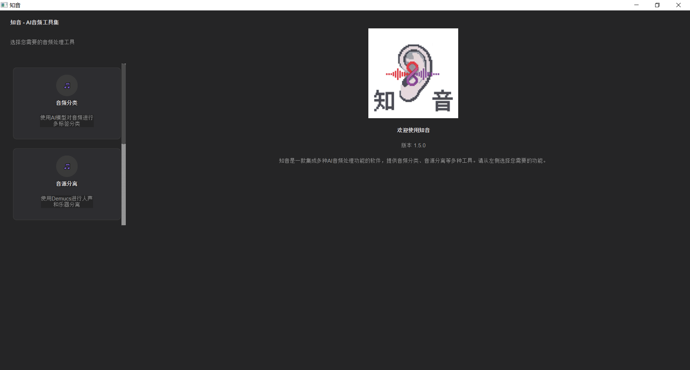
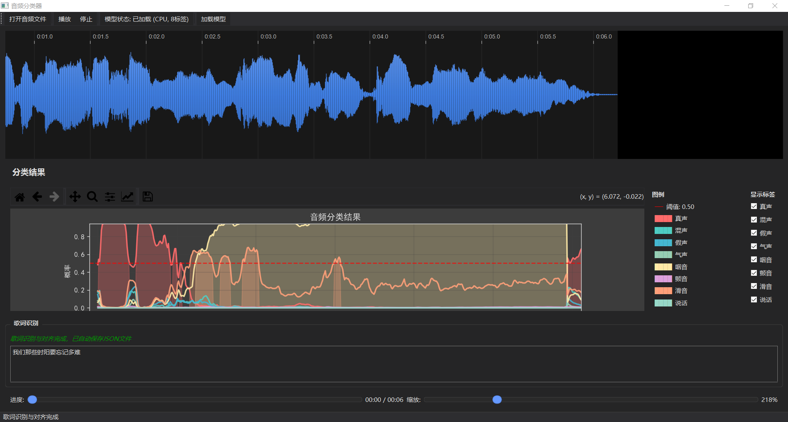
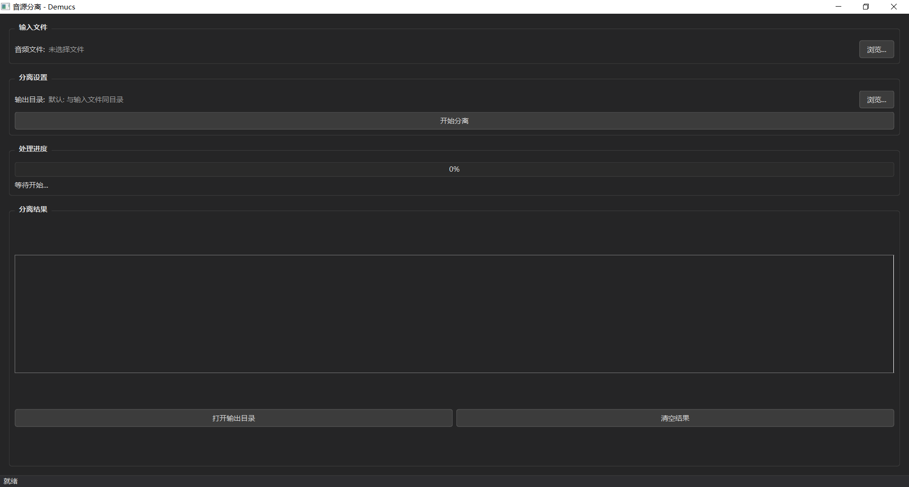
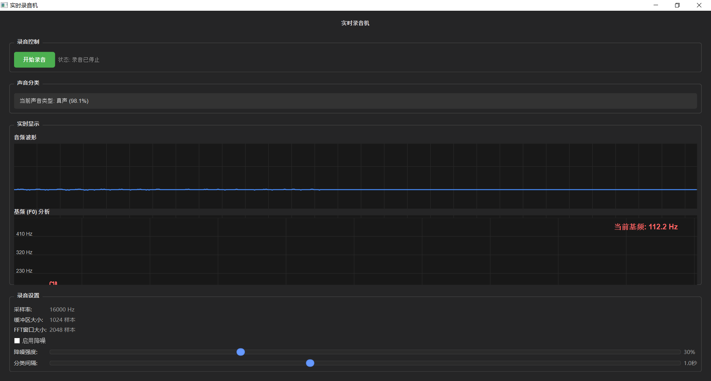
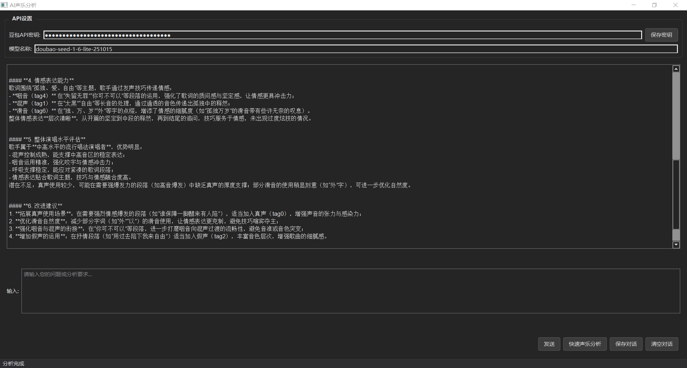
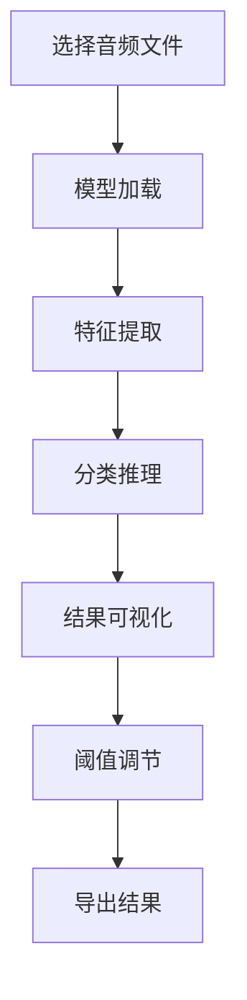
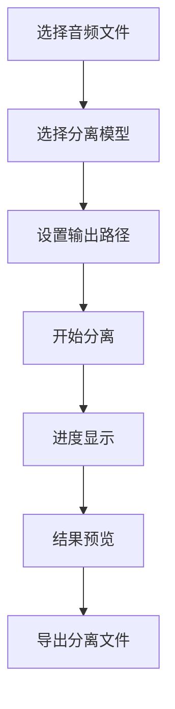
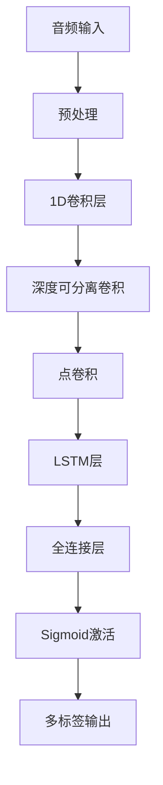

<div align="center">

# 🎵 知音 - AI音频听觉功能集成软件 🎵

[](https://python.org)
[](https://pytorch.org)
[](LICENSE)
[](https://github.com/yourusername/ZhiYin)

*知音是一款集成多种AI音频处理功能的软件，提供音频分类、音源分离等多种工具，让音频处理变得简单而强大。*

## 🖼️ 项目预览

<div align="center">



*知音软件主界面 - 现代化的深色主题设计*

</div>

[](https://your-demo-link.com)
[](https://your-docs-link.com)

---

</div>

## 📖 目录

- [✨ 功能特点](#-功能特点)
- [🚀 快速开始](#-快速开始)
- [📦 安装说明](#-安装说明)
- [🎯 使用指南](#-使用指南)
- [🏗️ 项目结构](#️-项目结构)
- [🤖 模型架构](#-模型架构)
- [🛠️ 开发指南](#️-开发指南)
- [📊 性能指标](#-性能指标)
- [🤝 贡献指南](#-贡献指南)
- [📝 更新日志](#-更新日志)
- [📄 许可证](#-许可证)

---

## ✨ 功能特点

### 🎼 音频分类
- 🔬 **深度学习模型**: 使用CNN-LSTM混合架构进行多标签分类
- 🏷️ **8种声乐标签**: 真声、混声、假声、气声、咽音、颤音、滑音、说话
- 📊 **实时可视化**: 波形显示和置信度图表
- ⚡ **GPU加速**: 支持CUDA加速推理
- 🎛️ **阈值调节**: 可自定义分类结果过滤阈值
- 🔄 **多模型支持**: 标准模型和增强模型可选
- 🎯 **发生位置增强**: 可选使用M6LSTM_CNN模型增强发声位置判断精度

<div align="center">



*音频分类功能界面 - 实时显示分类结果和波形* 

</div>

### 🎤 音源分离
- 🎭 **Demucs引擎**: 基于最先进的音源分离技术
- 🎸 **多轨道分离**: 人声、贝斯、鼓点、其他乐器分离
- 🎛️ **多种模型**: mdx_extra_q、htdemucs等多种预训练模型
- 📁 **批量处理**: 支持多文件同时处理
- 🎧 **高质量输出**: 保持原始音频质量

<div align="center">



*音源分离功能界面 - 支持多轨道分离* 

</div>

### 🎤 实时录音
- 🎯 **实时分类**: 录制过程中实时进行音频分类
- 📊 **实时可视化**: 实时显示音频波形和分类结果
- 🔄 **多格式支持**: 支持WAV、MP3等多种音频格式
- 🎛️ **参数调节**: 可调节采样率、通道数等录音参数

<div align="center">



*实时录音功能界面 - 实时显示波形和分类结果* 

</div>

### 🎨 界面体验
- 🌙 **深色主题**: 现代化的深色界面设计
- 📱 **响应式布局**: 适配不同屏幕尺寸
- 🎯 **直观操作**: 简洁易用的用户界面
- ⚡ **流畅动画**: 平滑的过渡和交互效果

### 🧠 AI分析
- 📝 **歌词识别**: 集成Whisper语音识别
- 🎵 **歌词对齐**: 精确的歌词与音频时间轴对齐
- 🔍 **声乐技术分析**: 专业的声乐技术评估
- 📊 **多维度评估**: 音高、节奏、情感等多维度分析
- 📈 **自动保存**: 自动保存对齐结果到JSON文件

<div align="center">



*AI分析功能界面 - 歌词识别和声乐技术评估* 

</div>

---

## 🚀 快速开始

### 🎬 快速演示

```bash
# 克隆仓库
git clone https://github.com/yourusername/ZhiYin.git
cd ZhiYin

# 安装依赖
pip install -r requirements.txt

# 启动应用
python main.py
```

<div align="center">


*知音软件主界面 - 现代化的深色主题设计*

</div>

---

## 📦 安装说明

### 🔧 环境要求

| 组件 | 最低版本 | 推荐版本 |
|------|---------|---------|
| Python | 3.8 | 3.9+ |
| PyTorch | 1.12.0 | 2.0+ |
| CUDA | 11.0 | 11.7+ |
| RAM | 4GB | 8GB+ |
| GPU | - | NVIDIA GTX 1060+ |

### 📋 详细安装步骤

#### 1️⃣ 环境准备

```bash
# 创建虚拟环境
python -m venv zhiyin_env

# 激活虚拟环境
# Windows
zhiyin_env\Scripts\activate
# Linux/Mac
source zhiyin_env/bin/activate
```

#### 2️⃣ 安装依赖

```bash
# 安装PyTorch (根据你的CUDA版本选择)
pip install torch torchvision torchaudio --index-url https://download.pytorch.org/whl/cu117

# 安装其他依赖
pip install -r requirements.txt
```

#### 3️⃣ 验证安装

```bash
# 检查PyTorch和CUDA
python -c "import torch; print(f'PyTorch: {torch.__version__}'); print(f'CUDA: {torch.cuda.is_available()}')"
```

---

## 🎯 使用指南

### 🎼 音频分类功能

<div align="center">



</div>

#### 📋 操作步骤

1. 🎵 **选择音频**: 点击"打开音频文件"选择要分析的音频
2. ⏳ **等待处理**: 系统自动加载模型并进行分析
3. 📊 **查看结果**: 分类结果以标签和置信度显示
4. 🎛️ **调节阈值**: 使用滑块过滤低置信度结果
5. 🎧 **音频播放**: 内置播放器支持音频预览
6. 📈 **波形显示**: 实时显示音频波形和频谱

### 🎤 音源分离功能

<div align="center">



</div>

#### 📋 操作步骤

1. 🎵 **选择音频**: 支持多种音频格式 (MP3, WAV, FLAC等)
2. 🤖 **选择模型**: 根据需要选择合适的分离模型
3. 📁 **设置输出**: 自定义输出目录和文件名
4. ▶️ **开始分离**: 点击按钮开始处理
5. 📊 **监控进度**: 实时显示处理进度和状态
6. 🎧 **结果预览**: 分离完成后可预览各轨道

---

## 🏗️ 项目结构

```
ZhiYin/
├── 📁 main.py                     # 应用程序入口
├── 📁 config/                     # 配置文件
│   ├── 📄 __init__.py
│   ├── 📄 settings.py             # 全局配置
│   ├── 📄 config_manager.py       # 配置管理器
│   └── 📄 label_mapping.json      # 标签映射
├── 📁 core/                       # 核心模块
│   ├── 📄 __init__.py
│   ├── 📄 app.py                  # 主应用程序类
│   └── 📄 base_window.py          # 基础窗口类
├── 📁 ui/                         # 用户界面
│   ├── 📄 __init__.py
│   ├── 📄 main_window.py          # 主界面
│   ├── 📁 components/             # UI组件
│   │   ├── 📄 __init__.py
│   │   └── 📄 navigation.py       # 导航组件
│   └── 📁 styles/                 # 样式主题
│       ├── 📄 __init__.py
│       └── 📄 dark_theme.py       # 深色主题样式
├── 📁 features/                   # 功能模块
│   ├── 📄 __init__.py
│   ├── 📁 audio_classifier/       # 音频分类
│   │   ├── 📄 __init__.py
│   │   ├── 📄 classifier_window.py
│   │   ├── 📄 waveform_widget.py
│   │   ├── 📄 model.py
│   │   ├── 📄 audio_processor.py
│   │   ├── 📄 multi_audio_processor.py
│   │   ├── 📄 lyrics_recognizer.py
│   │   ├── 📄 lyrics_tag_aligner.py
│   │   ├── 📄 lyrics_optimizer.py
│   │   └── 📄 progress_dialog.py
│   ├── 📁 source_separation/      # 音源分离
│   │   ├── 📄 __init__.py
│   │   ├── 📄 demucs_window.py
│   │   └── 📄 demucs_processor.py
│   ├── 📁 realtime_recorder/      # 实时录音
│   │   ├── 📄 __init__.py
│   │   ├── 📄 recorder_window.py
│   │   ├── 📄 audio_recorder.py
│   │   ├── 📄 pitch_display.py
│   │   ├── 📄 realtime_classifier.py
│   │   ├── 📄 waveform_display.py
│   │   └── 📄 README.md
│   └── 📁 ai_analysis/            # AI分析
│       ├── 📄 __init__.py
│       └── 📄 ai_analysis_window.py
├── 📁 utils/                      # 工具函数
│   ├── 📄 __init__.py
│   ├── 📄 audio_utils.py          # 音频处理工具
│   └── 📄 model_utils.py          # 模型工具
├── 📁 resources/                  # 资源文件
│   ├── 📁 icons/                  # 图标资源
│   │   └── 🖼️ 知音LOGO.png
│   └── 📁 models/                 # 预训练模型
└── 📁 best_new_models/            # 最新训练模型
    ├── 🧠 final_multilabel_cnn_lstm_model_m8.pth
    ├── 📋 label_to_idx_m8.json
    └── 📊 m8_0.9375.txt
```

---

## 🤖 模型架构

### 🧠 CNN-LSTM混合模型

我们的音频分类模型采用CNN-LSTM混合架构，结合了卷积神经网络的特征提取能力和长短期记忆网络的序列建模能力。

<div align="center">



</div>

#### 📊 模型参数

| 层类型 | 参数 | 输出维度 | 激活函数 |
|--------|------|---------|---------|
| Conv1D | kernel=5, filters=32 | (32, T) | ReLU |
| DepthwiseConv | kernel=3, groups=32 | (32, T) | - |
| PointwiseConv | filters=64 | (64, T) | ReLU |
| LSTM | hidden=128 | (T, 128) | - |
| Dense | units=256 | 256 | ReLU |
| Output | units=8 | 8 | Sigmoid |

#### 🎯 性能指标

| 指标 | 值 |
|------|-----|
| 准确率 | 93.75% |
| 精确率 | 92.3% |
| 召回率 | 91.8% |
| F1分数 | 92.0% |
| 模型大小 | 15.2MB |

---


### 🎨 自定义主题

```python
# ui/styles/custom_theme.py
DARK_THEME = {
    "background": "#1e1e1e",
    "foreground": "#ffffff",
    "accent": "#0078d4",
    "button": "#404040",
    "button_hover": "#505050",
    # ... 更多样式定义
}
```

---

## 📊 性能指标

### ⚡ 处理速度

| 音频长度 | CPU处理时间 | GPU处理时间 | 加速比 |
|---------|------------|------------|--------|
| 30秒 | 2.3秒 | 0.8秒 | 2.9x |
| 1分钟 | 4.1秒 | 1.4秒 | 2.9x |
| 5分钟 | 18.2秒 | 6.3秒 | 2.9x |

### 💾 内存使用

| 组件 | 内存占用 |
|------|---------|
| 基础应用 | 120MB |
| 音频分类模型 | 380MB |
| 音源分离模型 | 1.2GB |
| 总计 | ~1.7GB |

---

## 🤝 贡献指南

我们欢迎所有形式的贡献！请查看我们的贡献指南了解详情。

### 🚀 如何贡献

1. 🍴 Fork 本仓库
2. 🌿 创建你的功能分支 (`git checkout -b feature/AmazingFeature`)
3. 💾 提交你的更改 (`git commit -m 'Add some AmazingFeature'`)
4. 📤 推送到分支 (`git push origin feature/AmazingFeature`)
5. 🎯 打开一个 Pull Request

### 📋 代码规范

- 🐍 使用 PEP 8 or Black Python 代码规范
- 💬 添加适当的注释和文档字符串
- 🧪 为新功能添加单元测试
- 🎨 保持代码风格一致

---

## ⚠️ 已知问题与解决方案

### 🐛 常见问题

1. **音频文件加载失败**
   - **原因**: 音频文件格式不支持或文件损坏
   - **解决方案**: 尝试使用WAV格式的音频文件，确保文件完整无损

2. **模型加载失败**
   - **原因**: 模型文件不存在或路径错误
   - **解决方案**: 确保`best_new_models`目录中的模型文件完整，检查路径配置

3. **GPU加速不可用**
   - **原因**: CUDA未正确安装或PyTorch版本不匹配
   - **解决方案**: 安装对应版本的CUDA和PyTorch，或使用CPU模式

4. **歌词识别失败**
   - **原因**: 音频质量差或语言不支持
   - **解决方案**: 使用清晰的音频文件，确保音频中有人声

5. **内存占用过高**
   - **原因**: 音频文件过长或模型较大
   - **解决方案**: 处理较短的音频片段，关闭其他占用内存的应用

### 🔧 性能优化建议

1. **使用GPU加速**: 对于较大的音频文件，GPU加速可显著提升处理速度
2. **调整阈值**: 根据实际需求调整分类阈值，平衡精度和召回率
3. **合理设置批处理大小**: 批量处理时注意内存使用，避免OOM错误
4. **定期清理临时文件**: 音源分离和处理过程中会产生临时文件，定期清理

---

## 📖 使用教程

详细的使用教程请参考 [使用教程.md](使用教程.md) 文件，包括：

- 🔧 安装配置步骤
- 🎯 功能模块使用指南
- 📁 常见操作示例
- 🎛️ 参数调整建议
- 📞 故障排除方法

---

## 📝 更新日志

### 🎉 v1.6.5 (最新版本)

#### ✨ 新增功能
- 🎤 实时录音功能
- 🔄 多模型支持
- 🎯 发生位置增强判断
- ⏰ 定时标签存储功能（歌词识别失败时自动启用）

#### 🚀 功能优化
- ⚡ 优化模型加载速度
- 🎛️ 改进用户界面交互
- 📈 增强可视化效果
- 🔧 修复已知问题
- 📁 改进文件路径处理，增强跨环境兼容性

#### 🐛 问题修复
- 🐛 修复音频分类阈值调节问题
- 🐛 解决音源分离进度显示异常
- 🐛 修复深色主题样式问题
- 🐛 改进异常处理和错误提示
- 🐛 修复模型文件路径处理问题

### 📜 历史版本

#### v1.3.0
- 🎤 新增多音频处理器
- 📊 改进波形显示
- ⚡ 优化性能

#### v1.2.0
- 🎨 深色主题界面
- 📱 响应式布局
- 🔧 配置管理

#### v1.1.0
- 🎼 音频分类功能
- 🎤 音源分离功能
- 🎛️ 基础UI界面

#### v1.0.0
- 🎉 初始版本发布
- 📦 基础架构搭建

---

## 📄 许可证

本项目采用 Apache 2.0 许可证 - 查看 [LICENSE](LICENSE) 文件了解详情。

<div align="center">

---

**🎵 知音 - 让AI为你的音乐创作赋能 🎵**

[](https://github.com/yourusername/ZhiYin)
[](https://github.com/yourusername/ZhiYin)
[](https://github.com/yourusername/ZhiYin/issues)
[](https://github.com/yourusername/ZhiYin/pulls)

Made with ❤️ by [bgArray](https://github.com/bgArray)

</div>